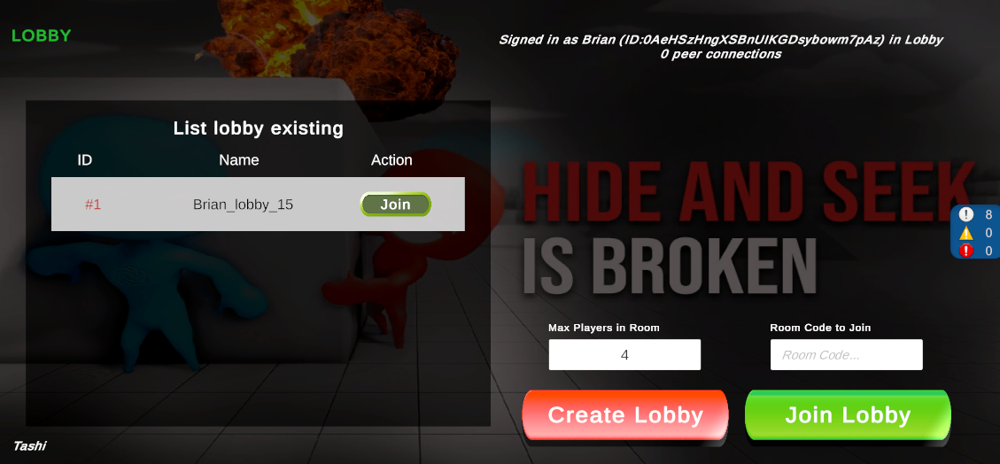

# Simple Tashi Step by step : 
- This step 2 : When import Tashi and create lobby, list lobby, start room .

## Import Tashi newest version : 
- At this time : Tashi 0.3.2 is the newest. [Link](https://github.com/tashigg/tashi-network-transport/releases)
- Import Tashi by tar file.
- Go PackageManager and Import com.unity.multiplayer.tools Package.

- In this project, for more focus and simple, I'just write almost logic and func about Logic, Authen, Lobby in MenuSceneManager.
## Create LobbyInstance to Serialize Lobby Data - DevMode: 
- Create class LobbyInstance like this : 
```c# 
[System.Serializable]
public class LobbyInstance //Just for debug
{
    public string HostId, Id, LobbyCode, Upid, EnvironmentId, Name;
    public int MaxPlayers, AvailableSlots;
    public bool IsPrivate, IsLocked;

    public LobbyInstance(Lobby lobby)
    {
        HostId = lobby is null ? "" : lobby.HostId;
        Id = lobby is null ? "" : lobby.Id;
        LobbyCode = lobby is null ? "" : lobby.LobbyCode;
        Upid = lobby is null ? "" : lobby.Upid;
        EnvironmentId = lobby is null ? "" : lobby.EnvironmentId;
        Name = lobby is null ? "" : lobby.Name;

        MaxPlayers = lobby is null ? 8 : lobby.MaxPlayers;
        AvailableSlots = lobby is null ? 8 : lobby.AvailableSlots;

        IsPrivate = lobby is null ? false : lobby.IsPrivate;
        IsLocked = lobby is null ? false : lobby.IsLocked;
    }
}
```

## Create Lobby in Lobby Manager :
- LobbyManager is a singleton that's created in start scene. 
- **Overview** : Once the parameters (name, maxPlayerInRoom) have been supplied, we will construct the lobby (and start the server) and update the status once the lobby has been successfully created.
Do a hearbeat ping in Update() to keep the lobby active.
Update PlayerDataObject and LobbyData in Tashi by running Update OutgoingSessionDetails and Update IncomingSessionDetails.
This page will be updated with new information about Lobby. When lobby is running, players can change state or their data via PlayerDataObject in Lobby.

- Create function `CreateLobby()` in `MenuSceneManager.cs`: 
```c#
    public async void CreateLobby()
    {
        int maxPlayerInRoom = 8;
        if (int.TryParse(_numberPlayerInRoomTextField.text, out int rs))
        {
            maxPlayerInRoom = rs;
        }
        else
        {
            maxPlayerInRoom = 8;
        }

        _numberPlayerInRoomTextField.text = maxPlayerInRoom.ToString();

        // NetworkManager.Singleton.StartHost();

        var lobbyOptions = new CreateLobbyOptions
        {
            IsPrivate = false,
        };
        string lobbyName = this.LobbyName();

        LobbyManager.Instance.CurrentLobby =
            await LobbyService.Instance.CreateLobbyAsync(lobbyName, maxPlayerInRoom, lobbyOptions);
        LobbyManager.Instance.isLobbyHost = true;
        _roomCodeLobbyTextField.text = LobbyManager.Instance.CurrentLobby.LobbyCode;
        Debug.Log(
            $"= Create Lobby name : {lobbyName} has max {maxPlayerInRoom} players. Lobby Code {LobbyManager.Instance.CurrentLobby.LobbyCode}");
        UpdateStatusText();
        LobbyManager.Instance.isSetInitPlayerDataObject = false;
    }
```
- First import `using Tashi.NetworkTransport` to LobbyManager.cs 
- Define `NetworkTransport` and create some func to `CheckLobbyUpdate` for update info lobby interval in `LobbyManager.cs`: 
```c# 
    private TashiNetworkTransport NetworkTransport => NetworkManager.Singleton.NetworkConfig.NetworkTransport as TashiNetworkTransport;
    private Lobby _lobby;
    public Lobby CurrentLobby
    {
        get {return _lobby; }
        set { _lobby = value;
            SerializeFieldLobby = new LobbyInstance(_lobby);
        }
    }
    public LobbyInstance SerializeFieldLobby;
    public bool isLobbyHost = false;
    public float nextHeartbeat; /* Time send heart beat to keep connection to lobby alive */
    public float nextLobbyRefresh; /* Time get update lobby info */
    /* If Tashi has already been set as a PlayerDataObject, we can set our own PlayerDataPbject in the Lobby. */
    public bool isSetInitPlayerDataObject = false;

    ...
    private void Update()
    {
        CheckLobbyUpdate();
    }
    public async void CheckLobbyUpdate()
    {
        if (CurrentLobby is null) return;
        if (Time.realtimeSinceStartup >= nextHeartbeat && isLobbyHost)
        {
            nextHeartbeat = Time.realtimeSinceStartup + 15;
            /* Keep connection to lobby alive */
            await LobbyService.Instance.SendHeartbeatPingAsync(CurrentLobby.Id);
        }

        if (Time.realtimeSinceStartup >= nextLobbyRefresh)
        {
            this.nextLobbyRefresh = Time.realtimeSinceStartup + 2; /* Update after every 2 seconds */
            this.LobbyUpdate();
            this.ReceiveIncomingDetail();
        }
    }
    /* Tashi setup/update PlayerDataObject */
    public async void LobbyUpdate()
    {
        var outgoingSessionDetails = NetworkTransport.OutgoingSessionDetails;

        var updatePlayerOptions = new UpdatePlayerOptions();
        if (outgoingSessionDetails.AddTo(updatePlayerOptions))
        {
            // Debug.Log("= PlayerData outgoingSessionDetails AddTo TRUE so can UpdatePLayerAsync");
            CurrentLobby = await LobbyService.Instance.UpdatePlayerAsync(CurrentLobby.Id,
                AuthenticationService.Instance.PlayerId,
                updatePlayerOptions);

            if (isSetInitPlayerDataObject == false)
            {
                isSetInitPlayerDataObject = true;
                UpdatePlayerDataInCurrentLobby(CurrentLobby, AuthenticationService.Instance.Profile,
                    isLobbyHost ? PlayerTypeInGame.Police.ToString() : PlayerTypeInGame.Thief.ToString(), false);
            }
        }

        if (isLobbyHost)
        {
            var updateLobbyOptions = new UpdateLobbyOptions();
            if (outgoingSessionDetails.AddTo(updateLobbyOptions))
            {
                CurrentLobby = await LobbyService.Instance.UpdateLobbyAsync(CurrentLobby.Id, updateLobbyOptions);
            }
        }
    }
    /* Tashi Update/get lobby session details */
    public async void ReceiveIncomingDetail()
    {
        try
        {
            if (NetworkTransport.SessionHasStarted) return;
            CurrentLobby = await LobbyService.Instance.GetLobbyAsync(CurrentLobby.Id);
            var incomingSessionDetails = IncomingSessionDetails.FromUnityLobby(CurrentLobby);

            // This should be replaced with whatever logic you use to determine when a lobby is locked in.
            if (incomingSessionDetails.AddressBook.Count >= 2)
            {
                NetworkTransport.UpdateSessionDetails(incomingSessionDetails);
            }
        }
        catch (Exception)
        {
        }
    }
```
- Beside that, in `MenuSceneManager.cs`, `CheckLobbyUpdate()` in `Update()` for reload state lobby everytime : 
```c#
    void Update()
    {
        CheckLobbyUpdate();

        CheckUpdateListRoom();
    }
    public async void CheckLobbyUpdate()
    {
        /* If Free, not in any lobby, show suiable UI */
        if (LobbyManager.Instance.CurrentLobby is null)
        {
            this._lobbyFreeGroup.SetActive(true);
            this._inLobbyGroup.SetActive(false);
            return;
        }

        /* If Are in lobby, just show suiable UI */
        this._lobbyFreeGroup.SetActive(false);
        this._inLobbyGroup.SetActive(true);

        _startRoomButton.gameObject.SetActive(LobbyManager.Instance.isLobbyHost);
        _readyRoomButton.gameObject.SetActive(!LobbyManager.Instance.isLobbyHost);


        this._playerCount = LobbyManager.Instance.CurrentLobby.Players.Count;
        /* Check if CurrentLobby has IsLocked = true, so it's ready to start game  */
        if (LobbyManager.Instance.CurrentLobby.IsLocked)
        {
            StartClient();
        }
        /* Update some status text in UI :  */
        UpdateStatusText();
    }
```

## Get List lobbies existing and Join Lobby : 
- First of all, create UI List lobby include : List Lobby, Lobby Item, UI In lobby and in room, UI when in lobby but not in room. 

- In `MenuSceneManager.cs`, define some variables for that list lobby : 
```c#
    ... 
    [Header("List Lobbies")] [SerializeField]
    /* Transform of Gameobject that'll contain list lobby item */
    [SerializeField] private Transform _listLobbiesContentTransform;
    /* Lobby Item prefab */
    [SerializeField] private LobbyItem _lobbyItemPrefab;
    /* List store all lobby item created */
    public List<LobbyItem> listLobbies = new();
    ...
```
- In `MenuSceneManager.cs`, create func to Get List Lobbies : 
```c# 
    public async void ListLobbies()
    {
        try
        {
            QueryLobbiesOptions queryLobbiesOptions = new QueryLobbiesOptions
            {
                Count = 25,
                Filters = new List<QueryFilter>
                {
                    /* Just get the lobby's available slots using the filter. */
                    new QueryFilter(QueryFilter.FieldOptions.AvailableSlots, "0", QueryFilter.OpOptions.GT)
                },
                Order = new List<QueryOrder>
                {
                    new QueryOrder(false, QueryOrder.FieldOptions.Created)
                }
            };

            QueryResponse queryResponse = await Lobbies.Instance.QueryLobbiesAsync(queryLobbiesOptions);

            /* Disative all old lobby item in list */
            foreach (Transform child in _listLobbiesContentTransform)
            {
                child.gameObject.SetActive(false);
            }

            listLobbies.Clear();
            /* Show every lobby item in list */
            int i = 0;
            foreach (Lobby lobby in queryResponse.Results)
            {
                LobbyItem lobbyItem;
                try
                {
                    lobbyItem = _listLobbiesContentTransform.GetChild(i).GetComponent<LobbyItem>();
                }
                catch (Exception)
                {
                    lobbyItem = Instantiate(_lobbyItemPrefab, _listLobbiesContentTransform);
                }

                lobbyItem.SetData("#" + (i + 1), lobby.Id, lobby.LobbyCode, lobby.Name);
                lobbyItem.SetOnClickJoin(OnClickJoinLobby);
                listLobbies.Add(lobbyItem);
            }
        }
        catch (Exception e)
        {
            Debug.LogError("Exception : " + e.ToString());
        }
    }
```
- Dont forget add onClick.AddListener for all your button with suitable func.
- When you already sign in and not in any lobby, so call get list lobbies and after a time call func to get list lobbies look like realtime : 
```c# 
    ...
        AuthenticationService.Instance.SignedIn += delegate
            {
                ...
                StopCoroutine(IEGetListLobbies()); // Stop old Coroutine if exist
                StartCoroutine(IEGetListLobbies());  // Start new Coroutine
            }
    ...
    IEnumerator IEGetListLobbies(float delayTime = 3f){
        while(AuthenticationService.Instance.IsSignedIn && string.IsNullOrEmpty(currentLobbyId)){
            yield return new WaitForSeconds(delayTime);
            ListLobbies();
        }
    }
```

## Create List Player In Room : Name, State 
- Define some variable to control list player data in `MenuSceneManager`: 
```c# 
    [Header("List PLayers in Room")]
    [SerializeField] private Transform _listPlayersContentTransform;
    [SerializeField] private PlayerItem _playerItemPrefab; /* NOtice : PlayerItem */
    public List<PlayerItem> listPlayers = new();
```
- It's the same with List Lobby, so I create the PlayerItem.cs for each item Player in Player List : 
```c#
    public class PlayerItem : MonoBehaviour {
    [SerializeField] public TextMeshProUGUI sttText;
    [SerializeField] public TextMeshProUGUI nameText;
    [SerializeField] public TextMeshProUGUI roleText;
    [SerializeField] public Image readyImage;
    [SerializeField] public Sprite isReadyImage;
    [SerializeField] public Sprite isNotReadyImage;
    public void SetData(string stt,string name, PlayerTypeInGame role, bool isReady = false){
        sttText.text = stt;
        nameText.text = name;
        roleText.text = role.ToString();
        SetReadyImage(isReady);
        this.gameObject.SetActive(true);
    }
    public void SetReadyImage(bool isReady = false){
        if(isReady){
            readyImage.sprite = isReadyImage;
        }else{
            readyImage.sprite = isNotReadyImage;
        }
    }
}
```
### Reload list player in room : 
- In `MenuSceneManager.cs`, start a coroutine to reload list player in room via PLayerDataObject in LobbyData : 
```c#
public IEnumerator IECheckUpdateListPLayerInRoom()
    {
        while (true)
        {
            yield return new WaitForSeconds(1f);
            if (AuthenticationService.Instance.IsSignedIn && LobbyManager.Instance.CurrentLobby is not null &&
                !string.IsNullOrEmpty(LobbyManager.Instance.CurrentLobby.Id))
            {
                /* Disative all old lobby item in list */
                foreach (Transform child in _listPlayersContentTransform)
                {
                    child.gameObject.SetActive(false);
                }

                listPlayers.Clear();
                /* Show every lobby item in list */
                int i = 0;

                foreach (Player p in LobbyManager.Instance.CurrentLobby.Players)
                {
                    try
                    {
                        if (p.Data["Name"] != null && p.Data["Role"] != null && p.Data["IsReady"] != null)
                        {
                            i++;
                            PlayerItem playerItem;
                            try
                            {
                                playerItem = _listPlayersContentTransform.GetChild(i).GetComponent<PlayerItem>();
                            }
                            catch (Exception)
                            {
                                playerItem = Instantiate(_playerItemPrefab, _listPlayersContentTransform);
                            }

                            playerItem.SetData("#" + (i), p.Data["Name"].Value, p.Data["Role"].Value.ToString(),
                                bool.Parse(p.Data["IsReady"].Value));
                            listPlayers.Add(playerItem);
                        }
                        else
                        {
                            continue;
                        }
                    }
                    catch (Exception e)
                    {
                        continue;
                    }
                }
            }
        }
    } 
```
- Next, add a function to `Update()` in `MenuSceneManager.cs` that checks to see if you are in the room, sets List Player in Room to data, and displays list player in UI if you are. 
- **Notice** : _PlayerDataObject in Lobby, when you LobbyService.Instance.UpdatePlayerAsync(currentLobbyId, playerId, options) , it's just update which param you put in the options, event if you create new options, old data still exist if you dont remove or change it._

## Exit Current Room :

- Exit lobby : apply for both clients and host. If you are host and leave lobby, one of client left will become the host. 
```c# 
    public async void ExitCurrentLobby()
    {
        if (CurrentLobby == null) return;
        /* Remove this player out of this lobby */
        if (CurrentLobby.Players.Count > 1)
        {
            await LobbyService.Instance.RemovePlayerAsync(CurrentLobby.Id, AuthenticationService.Instance.PlayerId);
        }
        else
        {
            await LobbyService.Instance.DeleteLobbyAsync(CurrentLobby.Id);
        }

        isLobbyHost = false;
        isSetInitPlayerDataObject = false;
        CurrentLobby = null;
        NetworkManager.Singleton.Shutdown();
        
        if(MenuSceneManager.Instance is not null)
            MenuSceneManager.Instance.UpdateStatusText();
    }
    public void OnApplicationQuit()
    {
        ExitCurrentLobby();
    }
```

