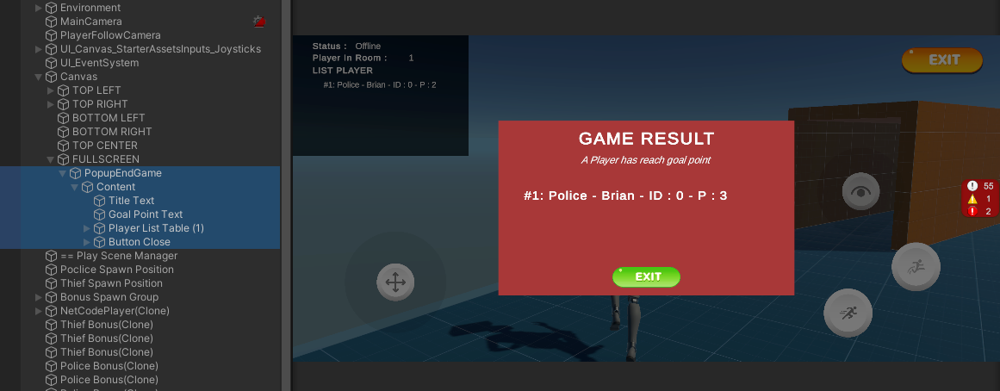

# Simple Tashi Step by step : 

## Import base package before Tashi : 
- In Unity Editor > Package manager > Unity Registry : Find and Install some packages (Netcode of gameobjects , Lobby, Relay maybe).

## Import newest Tashi package : 
- 28/7/2023 : 0.3.0 is available here : https://github.com/tashigg/tashi-network-transport/releases/tag/v0.3.0  (Update Tashi Relay)
- Download it and put tgz into folder Assets > Plugins 
- In Unity Editor > Window > Package Manager > Add package from tar ball > Choose Tashi.tgz from Assets > Plugins. 

- Tashi Relay URL https://eastus.relay.infra.tashi.dev/  ( Steven )

## Add Network Manager and Funtional button : 
- Create empty GameObject, add Network Manager component : Choose Transport protocol, drag player prefab and setup network prefabs lists.
- Choose Tashi Network Transport : Fill setup for relay base url or not. 
- Create in UI some buttons such as Start Server, Start Host and Start Client. Each button will call the function corresponding to function in Network Manager. 
- Create empty GameObject and attach new script to manage this scene. Script maybe have name like PlayManager.cs 
- Open PlayManager.cs and add some basically func : Start Host, Start Server, Start Client. using Unity.NetCode to use NetworkManager.Singleton or get info about NetCode.
- Add onClick for 3 button that we created before
- In Player Prefabs : Add component Network Object, Network Transform, Network Animation .. for sync some basic info. 
- Here I override Network Transform and Animation to Client Network Transform, Client Network Animation to turn off authoriatative from server. Trust on your clients.

* When import using Tashi, got an error when build to Mac app : The type 'Random' is defined in an assembly that is not referenced. You must add a reference to assembly 'Unity.Mathematics, Version=1.0.0.0, Culture=neutral, PublicKeyToken=null'.  So back to using NetCode for continues.

## Setup Player : Move, control 
* Target : Setup for control right client owned, camera follow client owned. 
- In Third Person Control : In Update > Check if(!IsOwner) return; so if you're not owner of this client, you can control. 
- In Player Prefabs : Untick Player Input. We'll detect and setup player input for localPlayer(or IsOwner Player) : Call this func when OnNetworkSpawn() : 
```c# 
    /* Setup for owner player : Camera, Player Input Movement, ... */
        protected void StartLocalPlayer()
        {
            if (IsClient && IsOwner)
            {
                _playerInput = GetComponent<PlayerInput>();
                _playerInput.enabled = true;
                PlayManager.Instance.PlayerFollowCamera.Follow = CinemachineCameraTarget.transform;
                _input = GetComponent<StarterAssetsInputs>();
                PlayManager.Instance.uiCanvasControllerInput.starterAssetsInputs = _input;
            }
        }
```
- In PlayManager.cs, create variable for PlayerFollowCamera, refer it from editor or load from script : 
```c# 
[SerializeField] private CinemachineVirtualCamera _playerFollowCamera;
    public CinemachineVirtualCamera PlayerFollowCamera { 
        get { 
            if(_playerFollowCamera == null){
                _playerFollowCamera = FindObjectOfType<CinemachineVirtualCamera>();
            }
            return _playerFollowCamera; 
        } 
    }
```
- At Start func in Player script, check FollowCamera if it's owner and local player. 
```c# 

if (IsLocalPlayer && IsOwner)
            {
                PlayManager.Instance.PlayerFollowCamera.Follow = CinemachineCameraTarget.transform;
            }
```

## Set Number Players In Room in UI : 
- Create a Network Variable store this value : 
```c# 
    private NetworkVariable<int> playersInRoom = new NetworkVariable<int>();
    public int PlayersInRoom
    {
        get { return playersInRoom.Value; }
    }
```
- Then when Start: Handle event OnClientConnected and Disconnected for changing number players in room like this : 
```c#
NetworkManager.Singleton.OnClientConnectedCallback += OnClientConnected;
        NetworkManager.Singleton.OnClientDisconnectCallback += OnClientDisconnected;
```
- Excecute change playersInRoom value when in server : When on server change this value, all client gonna be change after.
```c# 
private void OnClientConnected(ulong clientId)
    {
        Debug.Log($"Client ID {clientId} just Connected...");
        if (IsServer)
        {
            playersInRoom.Value++;
        }
    }
    private void OnClientDisconnected(ulong clientId)
    {
        Debug.Log($"Client ID {clientId} just disconnected...");
        if (IsServer)
        {
            playersInRoom.Value--;
        }
    }
```
- Finnaly, in Update we can update UI text to show : 
```c# 
    _amoutPlayerOnline.text = PlayersInRoom.ToString();
```
** The more simple way to show total clients connected : 
- On Start() : Add lines with func OnClientConnected, OnClientDisconnected are same as above: 
```c# 
        NetworkManager.Singleton.OnClientConnectedCallback += OnClientConnected;
        NetworkManager.Singleton.OnClientDisconnectCallback += OnClientDisconnected;

        if(IsServer){
            playersInRoom.Value ++;
        }
```
- Then in Update(), set UI text : 
    ```c# 
    _amoutPlayerOnline.text = PlayersInRoom.ToString();
    ```
## Set Username Sync NetCode : 
- In PlayerController (or st containt Player Logic, inherit NetworkBehaviour), create a playerName variable : 
```c# 
        public NetworkVariable<FixedString32Bytes> playerName = new NetworkVariable<FixedString32Bytes>("No-name", NetworkVariableReadPermission.Everyone, NetworkVariableWritePermission.Owner);
        public string PlayerName {
            get {return playerName.Value.ToString();}
        }
        public TextMeshPro playerNameText;
```
- You can create a struct called NetworkString repace for FixedString32Bytes and you can using NetworkVariable such as normaly string type. [Link](https://youtu.be/rFCFMkzFaog?t=1010)

* C1 : - in override func OnNetworkSpawn : 
```c# 
    /* Listen event when playerName changed value on server */
    playerName.OnValueChanged += OnPlayerNameChanged;
    /* Check if this client spawned, so set the player name notice to server */
    if(IsLocalPlayer){
        SetPlayerNameServerRpc(PlayerDataManager.Instance.playerData.name);
    }
```
- Create ServerRpc and ClientRpc : 
```c# 
        [ServerRpc(RequireOwnership = false)]
        public void SetPlayerNameServerRpc(string name)
        {
            Debug.Log(" SetPlayerNameServerRpc : " + name);
            /* When Network Variable change in server, it'll trigger event, notify to all clients via event OnValueChanged */
            playerName.Value = new FixedString32Bytes(name);
        }
```
- At func listen event PlayerName Change : OnPlayerNameChanged : do something such as set text in UI
```c# 
      private void OnPlayerNameChanged(FixedString32Bytes previous, FixedString32Bytes current)
        {
            Debug.Log($"= ClientID {NetworkManager.LocalClientId} detect Player Name Change : {current}");
            playerNameText.text = current.ToString();
        }
```
- Get back to Player prefab, Create UI Text show player name, and referencens it to variable `playerNameText` that declare at first step. 
- That's almost done : Start Host with name, Client join also have their custom name. 
* But still got a Bug. that's in last client view, the names of the previous players have not been updated. I'll fix it in nexts step. 
So I found a simple way to set player name for each player : 
- In OnNetworkSpawn() add this line, it'll change name for owner client and change in all other clients : 
```c# 
            if (IsOwner)
            {
                playerName.Value = new FixedString32Bytes(PlayerDataManager.Instance.playerData.name);
            }
```
- in Update() func, set playerNameText : 
        playerNameText.text = PlayerName;

## Manager List Player Network in Play Scene Manager :
- In PlayManager.cs, create variable store players network spawned : 
```c# 
    Dictionary<ulong, NetCodeThirdPersonController> playersList = new Dictionary<ulong, NetCodeThirdPersonController>();
    public Dictionary<ulong, NetCodeThirdPersonController> PlayersList { get => playersList; }
```
- And so I'll update value playersList in player script (NetCodeThirdPersonController for me) : 
```c# 
public override void OnNetworkSpawn()
        {
            base.OnNetworkSpawn();

            if (IsOwner)
            {
                playerName.Value = new FixedString32Bytes(PlayerDataManager.Instance.playerData.name);
            }
            /* Add new player to list */
            PlayManager.Instance.PlayersList.Add(this.OwnerClientId, this);
            StartLocalPlayer();
        }
        public override void OnNetworkDespawn()
        {
            base.OnNetworkDespawn();
            /* Remove player by clientID from list  */
            PlayManager.Instance.PlayersList.Remove(this.OwnerClientId);
        }
```
- And so on, in PlaySceneManager listPlayer will update automatically when has change. You could use this player list to show List Player in game (about name, hp, score or st);
- In this project, I firstly create a table to show List Player Name are in room. Back to UI Editor and create UI in play scene.
- And finnally, referencs list table, text row to fill list player in room info table. Example I writing in Update() : 
```c# 
    void Update()
    {
        _amoutPlayerOnline.text = PlayersInRoom.ToString();
        int i = 0 ;
        foreach(KeyValuePair<ulong, NetCodeThirdPersonController> player in PlayersList){
            // Debug.LogWarning($"= Client ID {player.Key} has Name {player.Value.PlayerName}");
            if(i <= listPlayerNameText.Length){
                listPlayerNameText[i].text = string.Format("#{0}: {3} - {1} - ID : {2}", i+1, player.Value.PlayerName, player.Key.ToString(), player.Value.TypeInGame.ToString());
                listPlayerNameText[i].gameObject.SetActive(true);
                i++;
            }
        }
        for(int j = i; j <= listPlayerNameText.Length - 1; j++){
            listPlayerNameText[j].gameObject.SetActive(false);
        }
    }
```

## Add Logic Game Hide and Seek : 
- In this project, The host will be Police and catch all other clients. The clients will be Thief and start running when spawned.
- Create tag Police and Thief. 
- Create variable storage state typeInGame of player , put it in NetCodeThirdPersonController.cs: 
```c# 
private NetworkVariable<PlayerTypeInGame> typeInGame = new NetworkVariable<PlayerTypeInGame>(PlayerTypeInGame.Thief, NetworkVariableReadPermission.Everyone, NetworkVariableWritePermission.Owner);
        public PlayerTypeInGame TypeInGame
        {
            get { return typeInGame.Value; }
        }
```
- OnNetworkSpawn(), Add listten OnTypeInGame value changed, check if IsOwner > if IsHost will setup this Player is Police : change typeInGame.Value and tag such as code below : 
```c# 
        public override void OnNetworkSpawn()
        {
            typeInGame.OnValueChanged += OnTypeInGameChange;
            if (IsOwner)
            {
                playerName.Value = new FixedString32Bytes(PlayerDataManager.Instance.playerData.name);
                /* Host create this room will be Police, and all next clients are thief */
                if (IsHost)
                {
                    typeInGame.Value = PlayerTypeInGame.Police;
                    this.tag = Constants.TAG_POLICE;
                }
                else
                {
                    typeInGame.Value = PlayerTypeInGame.Thief;
                    this.tag = Constants.TAG_THIEF;
                }
            }
            /* .... do st other */
        }
        public void OnTypeInGameChange(PlayerTypeInGame pre, PlayerTypeInGame current){
            this.tag = current.ToString(); /* Police or Thief */
        }
        public override void OnNetworkDespawn()
        { /* Remove listen when OnNetworkDespawn */
            base.OnNetworkDespawn();
            typeInGame.OnValueChanged -= OnTypeInGameChange;
            PlayManager.Instance.PlayersList.Remove(this.OwnerClientId);
        }
```
- Make something diff between Police and Thief, basiclly change text color for simple example, so when set playerNameText, I change the color also in Update(): 
```c# 
            if (TypeInGame == PlayerTypeInGame.Police)
            {
                playerNameText.color = Color.green;
            }
            else
            {
                playerNameText.color = Color.red;
            }
```

============================ LOGIC POLICE TOUCH THIEF ================= 
## Logic Police touch Thief : Show effect, count points, make thief immortal some seconds when get touched by Police : 
### Add Event Manager to manage all events in game : 
- Add script EventManager.cs in first scene and tick isPersistance for DontDestroyOnLoad. Add EventName TouchThief and we'll use it later.
Note that you should go Project Setting > Script Excecute Order and set timing for EventManager running first/before. 
- To check Police have touched thief or not, I've set the tag for particular player with their role. 
- In Third Person Controller, we have to check collide in BasicRigidBodyPush.cs that attach in Player Prefab. 
- In BasicRigidBodyPush.cs, create or adjust OnControllerColliderHit if it's exist like below : 
```c# 
    private void OnControllerColliderHit(ControllerColliderHit hit){
        ...
        /* If not police, dont check collide */
        /* If not police, dont check collide */
        if (this.gameObject.tag != Constants.TAG_POLICE) return;

		/* If you are Police, let's check what you touch */
        if (hit.gameObject.tag == Constants.TAG_THIEF)
        {
            /* Touched to Thief , let's do something */
			NetCodeThirdPersonController target = hit.gameObject.GetComponent<NetCodeThirdPersonController>();
			Debug.Log("Touch to Thief : IsImmortal : " + target.IsImmortal.ToString());
			/* Firstly check if this thief is in immortal state -> do nothing
			If are playing as normal, trigger event that police touch this thief and do some logic */
			if(!target.IsImmortal){
				/* Call func ON Touch Thief. */
				this.gameObject.GetComponent<NetCodeThirdPersonController>().OnTouchThief(target);
				
			}
			
        }
    }
```
- Ok so here, we sent event to this player know that they're touching thief and idetity of that thief via NetCodeThirdPersonController target variable. 
- In NetCodeThirdPersonController.cs, we add some codes : 
```c# 

        #region  Game Logic 
        /* Listen event TouchThief and ready to make notify to server know that I've catched a thief */
        public void OnTouchThief(NetCodeThirdPersonController target)
        {
            Debug.Log($"= Event OnTouchThief : I'm {PlayerName} - ID {OwnerClientId} and I catched a thief has name is {target.PlayerName} - ID: {target.OwnerClientId}");

            /* Call to ServerRpc to notify excute explosion effect for all clients */
            OnPoliceCatchedThiefServerRpc(target.OwnerClientId);
        }
```
- OK greate. Now you can start running 2 Instance game as Police and thief, and whenever Police touch to Thief, in log you'll see something like this : "= Event OnTouchThief : I'm Luuna - ID 1 and I catched a thief has name is Luuna - ID: 1" -> Notify the information that's what I need to next step.
### Show prefab explosion and notify ServerRpc so that all clients are aware that someone has been caught: 
- OnTouchThief we've created above, I'll call a ServerRpc to notyfy excecute explostion for all clients : 
```c# 
    public void OnTouchThief(Dictionary<string, object> msg){
        ...
        /* Call to ServerRpc to notify excute explosion effect for all clients */
            OnPoliceCatchedThiefServerRpc(OwnerClientId, target.OwnerClientId);
    }
```
- Create func OnPoliceCatchedThiefServerRpc like this: 
```c# 
    [ServerRpc]
        public void OnPoliceCatchedThiefServerRpc(ulong fromClientId, ulong targetClientId, ServerRpcParams serverRpcParams = default){
            /* We have 2 ways to this thing : Choose one and comment the other one */
            
            /* Option 1: Spawn on server, so all clients automacally spawn this effect : But got error when you trying destroy this object from clients */
            GameObject explosionVfx = Instantiate(PlayManager.Instance.explosionBoomPrefab);
            explosionVfx.GetComponent<NetworkObject>().Spawn();
            explosionVfx.transform.position = NetworkManager.Singleton.ConnectedClients[targetClientId].PlayerObject.transform.position;

            /* Option 2: Notify for all client know where explosion happend and act it on client : So you can control and destroy this object */
            ShowExplosionEffectInClientRpc(targetClientId);
        }
```
- In this video I'll using option 2 because the explosion it's just to show vfx and not affect to logic/points or something important. 
- So continously create ShowExplosionEffectInClientRpc to receive notify from ServerRpc : 
```c# 
        [ClientRpc]
        public void ShowExplosionEffectInClientRpc(ulong targetClientId){
            /* Receive info from Server and perform explosion in client */
            GameObject explosionVfx = Instantiate(PlayManager.Instance.explosionBoomPrefab);
            explosionVfx.transform.position = PlayManager.Instance.PlayersList[targetClientId].gameObject.transform.position;
            /* I've set auto destroy this particle system when it's done.  */
        }
```
- It's maybe ok rn. Let's run 2 instance game and check collide between police and thief.

### Make game logic IsImmortal for Thief in 3 seconds when have been caught by Police : 
- Create variable isImmortal : 
```c# 
    [Tooltip("isImmortal : true -> police cannot catch this thief when touch. This variable just change on ServerRpc. Don't trust client")]
        private NetworkVariable<bool> isImmortal = new NetworkVariable<bool>(false, NetworkVariableReadPermission.Everyone, NetworkVariableWritePermission.Server);
        public bool IsImmortal { get { return isImmortal.Value; } }
```
- Listen event when isImmortal value changed in OnNetworkSpawn and OnNetworkDespawn : 
```c# 
        base.OnNetworkSpawn();
        isImmortal.OnValueChanged += OnIsImmortalChange;
        ...
        base.OnNetworkDespawn();
        isImmortal.OnValueChanged -= OnIsImmortalChange;

        /* Cause I change isImmortal in server so in this func just using for Logging */
        public void OnIsImmortalChange(bool pre, bool current)
        {   
            if(!IsOwner) return; /* If it's not owner, do nothing */
            Debug.Log($"= OnIsImmortalChange Client Name {PlayerName} ID {NetworkManager.LocalClientId} change isImmortal from {pre.ToString()} to {current.ToString()}");
        }
```
- Now it's time to detech when we should change isImmortal value. This will be change in server when target thief got caught. Get back to func OnPoliceCatchedThiefServerRpc(), add the line make target thief immortal for some seconds : 
```c# 
    public void OnPoliceCatchedThiefServerRpc(ulong targetClientId, ServerRpcParams serverRpcParams = default){
        ...
            /* Set target Client immortal in some seconds */
            NetCodeThirdPersonController targetPlayer = NetworkManager.Singleton.ConnectedClients[targetClientId].PlayerObject.GetComponent<NetCodeThirdPersonController>();
            targetPlayer.isImmortal.Value = true;
            StartCoroutine(IESetImmortalFalse(targetPlayer, 3f)); /* delay 3 seconds before change isImmortal to false */
    }
    public IEnumerator IESetImmortalFalse(NetCodeThirdPersonController targetPlayer, float delay)
    {
        Debug.Log($"= IESetImmortalFalse Client Name {targetPlayer.PlayerName} Id {targetPlayer.OwnerClientId} start Coroutine change isImmortal to false");
        yield return new WaitForSeconds(delay);
        targetPlayer.isImmortal.Value = false;
    }
``` 
- Almost done.  Run and check.


### Logic count points : Increase/Decrease Point when Police touched Thief : 
- According my point of view, I think have 2 ways : change point and update in Update() or change point and listen OnValueChange to update UI. I use first way. 
- Declare 'Point' variable to store the point of each player  : 
```c# 
       /* Point to count the game logic : Police touch thief -> police's point ++ , thief's point -- */
        private NetworkVariable<int> point = new NetworkVariable<int>(0, NetworkVariableReadPermission.Everyone, NetworkVariableWritePermission.Server);
        public int Point {
            get { return point.Value;}
        }
```
- When Police touched Thief, make some login in ServerRpc, and in here, we calc the point (Increase Police's Point and Decrease Thief's point) like below : 
```c# 
        [ServerRpc(RequireOwnership = false)]
        public void OnPoliceCatchedThiefServerRpc(ulong targetClientId, ServerRpcParams serverRpcParams = default){
        ...
        /* Logic Increase Police's point, Decrease Thief's point */
            targetPlayer.point.Value --;
            senderPlayer.point.Value ++;

        }
```
- So now go back to PlaySceneManager and add the text point into table list Player. This table'll reload every update by change this line become : 
```c# 
    ...
    listPlayerNameText[i].text = string.Format("#{0}: {3} - {1} - ID : {2} - P : {4}", i+1, player.Value.PlayerName, player.Key.ToString(), player.Value.TypeInGame.ToString(), player.Value.Point);
```

### Logic Spawn Bonus in-game : Police Bonus and Thief Bonus Point : 
- Police bonus has green color. When Police touch Police Bonus, their point 'll increase. 
- Thief Bonus Point has red color. When Thief touch Thief Bonus, their point'll increase. 

- Create GameObject such as cube, and custom shape to what you like. For me, I custom that cube into item : change color,  animation turning around itself, add Tag Police Bonus/Thief Bonus, set IsTrigger in Box Collider, change scale, change rotation, add Network Object component. 
- Drag it into prefabs in Resources folder. add to Network Prefabs List. 
- Create BonusItem.cs to identity Bonus Prefab, it's include BonusData attribute. Add this script into Bonus prefab and define suiable params.
```c# 
    [Serializable]
    public class BonusData { 
        /* Type of this bonus is using for what character : Police or Thief */
        public BonusType bonusType = BonusType.Police;
        /* This value using to represents the value of increase and decrease. eg: Police speed increase [value], Thief increase point equal [value] */
        public int value = 1;
    }
```
- Add logic check Player collide with Bonus in NetcodeThirdPersonController.cs, Police just can collide with Police's Bonus, Thief collide with Thief's Bonus : 
```c#
        void OnTriggerEnter(Collider other)
        {
            /* If not Owner, don't do anything. If not add this line, other client in your side also come here */
            if(!IsOwner) return;
            
            BonusItem target = other.GetComponent<BonusItem>();
            
            /* if This is Police and touch to Police Bonus */
            if(target && target.bonusData.bonusType == BonusType.Police && TypeInGame == PlayerTypeInGame.Police){
                ulong bonusId = target.GetComponent<NetworkObject>().NetworkObjectId;
                Debug.Log($"== OnTriggerEnter with : {target.bonusData.bonusType} has NetworkObjectId : {bonusId}");
                PlayManager.Instance.PoliceTouchedPoliceBonusServerRpc(bonusId);
            }
            /* if This is Thief and touch to Thief Bonus */
            if(target && target.bonusData.bonusType == BonusType.Thief && TypeInGame == PlayerTypeInGame.Thief){
                ulong bonusId = target.GetComponent<NetworkObject>().NetworkObjectId;
                Debug.Log($"== OnTriggerEnter with : {target.bonusData.bonusType} has NetworkObjectId : {bonusId}");
                PlayManager.Instance.ThiefTouchedThiefBonusServerRpc(bonusId);
            }
        }
```

- Create list Spawn Bonus Point in Play Scene : I'll randomly spawn Bonus prefabs in that list position.
- Create ArrayList to store list spawn point that I've created before. 
```c# 
    [SerializeField] private Transform[] listSpawnBonusPosition; /* List positions could be choose for spawn new Bonus */
    [SerializeField] private GameObject policeBonusPrefab; 
    [SerializeField] private GameObject thiefBonusPrefab; 
    [SerializeField] private int maxPoliceBonus;  /* Max Police Bonus could be spawn in game */
    [SerializeField] private int maxThiefBonus; /* Max Thief Bonus could be spawn in game */
    private List<ulong> listPoliceBonusIdSpawned = new List<ulong>(); /* Store List Police Bonus are spawned in game */
    private List<ulong> listThiefBonusIdSpawned = new List<ulong>(); /* Store List Thief Bonus are spawned in game */
```
- When Start() PlaySceneManager, check if Server so SpawnBonus in map. After spawned object, don't forget save networkObjectId into list it's helpful for client identity gameobject. Then create func call when Police or Thief touched on their bonus, so I'll increase point, remove this bonusId from listBonusId, despawn this bonus and Call func to re-calculator spawn bonus in map: 
```c# 
    void Start(){
    ...
        if(IsServer){
                SpawnBonusPrefabServerRpc(); 
        }
    ...
    }
    #region ServerRPC 
    [ServerRpc(RequireOwnership = false)]
    private void SpawnBonusPrefabServerRpc()
    {
        Debug.Log("= SpawnBonusPrefabServerRpc");

        while (listPoliceBonusIdSpawned.Count < maxPoliceBonus)
        {
            /* Spawn Police Bonus Prefab */
            GameObject bonusP = Instantiate(policeBonusPrefab, listSpawnBonusPosition[Random.Range(0, listSpawnBonusPosition.Length)].position, Quaternion.identity);
            bonusP.transform.position += new Vector3(Random.Range(-1f, 1f), 1f, Random.Range(-1f, 1f));
            NetworkObject bonusPoliceNetworkObj = bonusP.GetComponent<NetworkObject>();
            bonusPoliceNetworkObj.Spawn();
            listPoliceBonusIdSpawned.Add(bonusPoliceNetworkObj.NetworkObjectId);
        }

        while (listThiefBonusIdSpawned.Count < maxPoliceBonus)
        {
            /* Spawn Police Bonus Prefab */
            GameObject bonusT = Instantiate(thiefBonusPrefab, listSpawnBonusPosition[Random.Range(0, listSpawnBonusPosition.Length)].position, Quaternion.identity);
            bonusT.transform.position += new Vector3(Random.Range(-1f, 1f), 1f, Random.Range(-1f, 1f));
            NetworkObject bonusThiefNetworkObj = bonusT.GetComponent<NetworkObject>();
            bonusThiefNetworkObj.Spawn();
            listThiefBonusIdSpawned.Add(bonusThiefNetworkObj.NetworkObjectId);
        }
    }
    [ServerRpc(RequireOwnership = false)]
    public void PoliceTouchedPoliceBonusServerRpc(ulong bonusId, ServerRpcParams serverRpcParams = default)
    {
        var senderId = serverRpcParams.Receive.SenderClientId;
        Debug.Log($"= PoliceTouchedPoliceBonusServerRpc: SenderID {senderId} touched BonusId : {bonusId}");
        /* Player touched Bonus Item : Add Bonus Value, Despawn and Spawn new bonus Item in other place after a time  */
        /* Get bonus object spawned by id */
        NetworkObject bonusItem = NetworkManager.Singleton.SpawnManager.SpawnedObjects[bonusId];
        listPoliceBonusIdSpawned.Remove(bonusId); /* Remove from list */
        bonusItem.Despawn(); /* Despawn on Server : apply for all clients */
        SpawnBonusPrefabServerRpc(); /* Re-calc and spawn bonus item if posible */
    }
    [ServerRpc(RequireOwnership = false)]
    public void ThiefTouchedThiefBonusServerRpc(ulong bonusId, ServerRpcParams serverRpcParams = default)
    {
        var senderId = serverRpcParams.Receive.SenderClientId;
        Debug.Log($"= ThiefTouchedThiefBonusServerRpc: SenderID {senderId} touched BonusId : {bonusId}");
        /* Thief touched Bonus Item : Add More points, Despawn and Spawn new bonus Item in other place after a time  */
        /* Get bonus object spawned by id */
        NetworkObject bonusItem = NetworkManager.Singleton.SpawnManager.SpawnedObjects[bonusId];
        listThiefBonusIdSpawned.Remove(bonusId); /* Remove from list */
        bonusItem.Despawn(); /* Despawn on Server : apply for all clients */
        SpawnBonusPrefabServerRpc(); /* Re-calc and spawn bonus item if posible */
    }
    #endregion
```

- Don't forget add RequireOwnership = false, so when client touch bonus can call to ServerRpc. 

### Change a bit logic when touch Bonus : Increase their Point : 
- For more simplier game play, so I've changed logic game when Police/Thief touched their Bonus Item, so I'll increase their Point : Add these lines to func touched Bonus in server : 
```c# 
        /* Increase Point for Police */
        NetCodeThirdPersonController sender = PlayersList[senderId];
        if(sender != null){
            sender.point.Value += bonusItem.GetComponent<BonusItem>().bonusData.value;
        }
```
- Get back to Play Scene and adjust max bonus can spawn of police, reduce it to smaller than max bonus can spawn of thief for balance game I think so because when Police touched Thief, Thief's point decrease and Police's point increase also. 
- OK So we're basically done game logic, so host and client can go into a room and chasing each other, take the bonus, get the point and let's see who has the best point when end the game. 

## Popup End Game :
- In this project, I'll make simple logic end game. That's when any player reach max goal point, the game'll be, show Popup result. 
- First of all, you'll need create a UI for Popup End Game like this : 


- In `PlayManager.cs`, we should create some variables : 
```c#
    ...
        [Header("Popup End Game")]
    [SerializeField] private GameObject _popupEndGame; // GameObject of Popup End Game content.
    [SerializeField] private Transform _listPlayerEndGameTransform;
    [SerializeField] public bool _isEndGame = false; // true when game has end.  
    [SerializeField] public int _pointEndGame; // End game when one of player reach this point.
    [SerializeField] private TextMeshProUGUI[] listEndGamePlayerNameText;
    
    // When Start(), disable popup end game. 
    void Start()
    {
        _popupEndGame.SetActive(false);
        _isEndGame = false;
        ...
```

- In `NetCodeThirdPersonController.cs`, we add some logic : Listen event Point change value and check if point has reach max point, call to ServerRpc to notice that one of player reached max point. 
- And then, In ServerRpc'll broadcast to all clients know that One of player has reached max point and show popup end game. 
```c#

      public override void OnNetworkSpawn()
        {
            base.OnNetworkSpawn();
            ...
            point.OnValueChanged += OnPointChange; // Dont forget remove OnValueChanged in OnNetworkDespawn.
            ...
        }
        /* Catch event when this point has changed */
        public void OnPointChange(int pre, int current)
        {
            if (!IsOwner) return;
            if (current >= PlayManager.Instance._pointEndGame)
            {
                Debug.Log($"$This Player {PlayerName} has reach End Game Point. Show Endgame now...");
                PlayManager.Instance.ShowPopupEndGameServerRpc();
            }
        }

        private void Update(){
            // stop every actions when isEndGame = true
            if (PlayManager.Instance._isEndGame) return;
            ...
        }
```
- Get back to `PlayManager.cs`. I'll create func ServerRpc, check show Popup End Game in here: 
```c#
     [ServerRpc(RequireOwnership = false)]
    public void ShowPopupEndGameServerRpc(ServerRpcParams serverRpcParams = default)
    {
        Debug.Log("== ShowPopupEndGameServerRpc Trigged. Broadcast event end game to all clients");
        ShowPopupEndGameClientRpc();
    }
    #endregion

    #region ClientRpc

    [ClientRpc]
    public void ShowPopupEndGameClientRpc()
    {
        _isEndGame = true;
        _popupEndGame.SetActive(true);
        /* Set active false for all item list player */
        foreach (Transform child in _listPlayerEndGameTransform)
        {
            child.gameObject.SetActive(false);
        }
        /* Fill list player data and score to table list player */
        int i = 0;
        foreach (KeyValuePair<ulong, NetCodeThirdPersonController> player in PlayersList)
        {
            // Debug.LogWarning($"= Client ID {player.Key} has Name {player.Value.PlayerName}");
            if (i <= listEndGamePlayerNameText.Length)
            {
                listEndGamePlayerNameText[i].text = string.Format("#{0}: {3} - {1} - ID : {2} - P : {4}", i + 1, player.Value.PlayerName, player.Key.ToString(), player.Value.TypeInGame.ToString(), player.Value.Point);
                listEndGamePlayerNameText[i].gameObject.SetActive(true);
                if (player.Value.Point >= _pointEndGame)
                {
                    listEndGamePlayerNameText[i].fontSize = listEndGamePlayerNameText[i].fontSize + 15;
                    listEndGamePlayerNameText[i].fontStyle = FontStyles.Bold;
                }
                i++;
            }
        }
    }

    #endregion
```


## Sign in, Login via UGS Authentication : 
- Go to Project Settings > Services and link to your project in Unity Dashboard. 
- Go to Unity Dashboard and Setup Authentication. 
- So in Unity Editor > Project Settings > Services > Authentication : You'll see the list user accounts. 
- Create UI Menu for Sign in : Text name, button sign in, status text. 
- In MenuSceneManager.cs, add this function to Sign in : 
```c# 
    using Unity.Services.Authentication;
    using Unity.Services.Core;
    using Unity.Services.Lobbies;
    ...
    public async void SignInButtonClicked(){
            if (string.IsNullOrEmpty(_nameTextField.text))
            {
                Debug.Log($"Signing in with the default profile");
                await UnityServices.InitializeAsync();
            }
            else
            {
                Debug.Log($"Signing in with profile '{_nameTextField.text}'");
                var options = new InitializationOptions();
                options.SetProfile(_nameTextField.text);
                await UnityServices.InitializeAsync(options);
            }

            try
            {
                signInButton.interactable = false;
                statusText.text = $"Signing in .... ";
                AuthenticationService.Instance.SignedIn += delegate
                {
                    PlayerDataManager.Instance.SetId(AuthenticationService.Instance.PlayerId);
                    UpdateStatusText();
                    profileMenu.SetActive(false);
                    lobbyMenu.SetActive(true);
                };

                await AuthenticationService.Instance.SignInAnonymouslyAsync();
            }
            catch (Exception e)
            {
                signInButton.interactable = true;
                statusText.text = $"Sign in failed : {e.ToString()} ";
                Debug.LogException(e);
                throw;
            }
        }
```
- In function, if you lack of what variable, just declare and refers it. 
- In Awake(), Init Unity Services : 
```c# 
    UnityServices.InitializeAsync();
```
- For the case comback from Play Scene to Menu Scene, let's check User signed in or not. So in MenuSceneManager,in Start() func call CheckAuthentication() : 
```c# 
    void CheckAuthentication()
    {
        /* Check signed in */
        if (AuthenticationService.Instance.IsSignedIn)
        {
            UpdateStatusText();
            profileMenu.SetActive(false);
            lobbyMenu.SetActive(true);
        }
        else
        {
            profileMenu.SetActive(true);
            lobbyMenu.SetActive(false);
        }
    }
```

## Create Lobby :
- Import Unity package Lobby in Unity Registry.  
- Create UI Lobby, Show it after signed in.
- Setup Lobby Project : Lobby Document [Link](https://docs.unity.com/ugs/en-us/manual/lobby/manual/get-started)
- See more in STEP 2 - Tashi.md.


